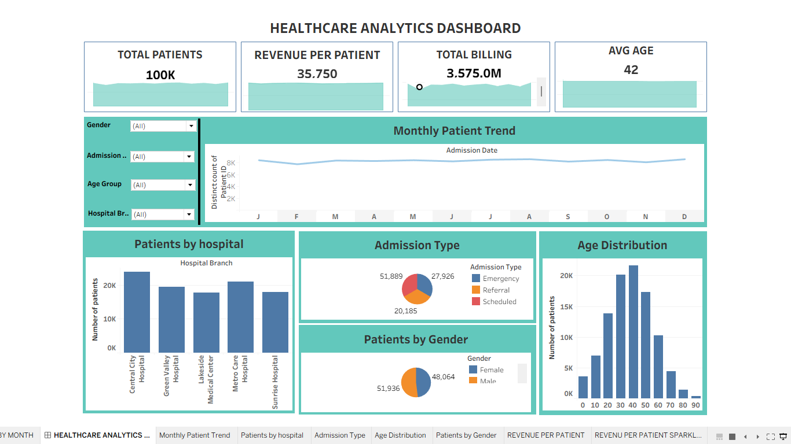

# Healthcare Analytics Dashboard -- Tableau

## 📊 Project Overview

This project is an interactive **Healthcare Analytics Dashboard** built
using **Tableau** to analyze 100,000 patient records and understand
patient volume, hospital performance, admission patterns, demographics,
and billing performance.

The dashboard combines KPI cards, trend analysis, categorical
comparisons, demographic analysis, filters, calculated fields, and KPI
sparklines to provide a clear view of healthcare operations.

## 🎯 Business Objectives

-   Monitor total patient volume
-   Analyze monthly patient trends
-   Compare patient volume across hospital branches
-   Understand admission type distribution
-   Analyze patient demographics by gender and age group
-   Track total billing
-   Calculate revenue per patient
-   Provide interactive filtering for deeper analysis

## 🛠️ Tools & Technologies

-   **Tableau Desktop**
-   **Microsoft Excel**
-   Data Visualization
-   Calculated Fields
-   KPI Cards
-   Interactive Filters
-   Table Calculations
-   Area Sparklines

## 📁 Dataset

The dataset contains **100,000 patient records** and includes fields
such as:

-   Patient ID
-   Gender
-   Age
-   Age Group
-   City
-   State
-   Hospital Branch
-   Admission Date
-   Discharge Date
-   Department
-   Diagnosis
-   Treatment
-   Admission Type
-   Room Type
-   Length of Stay
-   Insurance Type
-   Billing Amount
-   Insurance Coverage
-   Patient Payment
-   Payment Mode
-   Patient Rating
-   Readmission
-   Follow-Up Required
-   Profit Estimate
-   Revenue per Day

## 📈 Dashboard KPIs

  KPI                      Value
  --------------------- --------
  Total Patients            100K
  Revenue per Patient     35,750
  Total Billing           3.575B
  Average Patient Age         42

### Revenue per Patient Calculation

``` text
SUM([Billing Amount]) / COUNTD([Patient ID])
```

This calculated field measures the average billing generated per unique
patient.

## 📊 Dashboard Features

### 1. Monthly Patient Trend

Shows the monthly number of patients and helps identify changes in
patient volume throughout the year.

### 2. Patients by Hospital

Compares patient volume across the five hospital branches.

### 3. Admission Type

Analyzes the distribution of: - Scheduled - Emergency - Referral
admissions

### 4. Patients by Gender

Shows the distribution of male and female patients.

### 5. Age Distribution

Visualizes the number of patients across different age groups.

### 6. KPI Sparklines

Small area charts provide visual trends for selected KPI metrics such as
billing and patient-related performance.

### 7. Interactive Filters

Users can filter the dashboard by: - Gender - Admission Type - Age
Group - Hospital Branch

## 💡 Key Insights

-   The dataset contains **100,000 unique patients**.
-   **Central City Hospital** has the highest patient volume with
    **23,891 patients**.
-   **Scheduled admissions** are the largest admission category with
    **51,889 patients**.
-   Male patients account for **51,936** records, while female patients
    account for **48,064**.
-   The **31--45 age group** has the highest patient volume with
    **31,581 patients**.
-   Total billing is approximately **3.575 billion**.
-   Revenue per patient is approximately **35,750**.
-   The average patient age is approximately **42 years**.

## 📷 Dashboard Preview



## 📂 Project Files

-   `Healthcare_Analytics_Dashborad.twb` --- Tableau workbook
-   `healthcare_dataset(1).xlsx` --- Healthcare dataset
-   `Dashboard_Screenshot.png` --- Dashboard preview

## 🚀 How to Use

1.  Download or clone this repository.
2.  Open `Healthcare_Analytics_Dashborad.twb` using **Tableau Desktop**.
3.  If Tableau asks for the data source, reconnect it to
    `healthcare_dataset(1).xlsx`.
4.  Open the **HEALTHCARE ANALYTICS DASHBOARD** worksheet.
5.  Use the filters to interact with the dashboard.

## 📌 Project Purpose

This project was created as a **Data Analyst portfolio project** to
demonstrate skills in:

-   Data analysis
-   Tableau dashboard development
-   Data visualization
-   KPI development
-   Calculated fields
-   Interactive filtering
-   Business insight generation

## 👤 Author

**Vignesh**

**Role:** Aspiring Data Analyst
